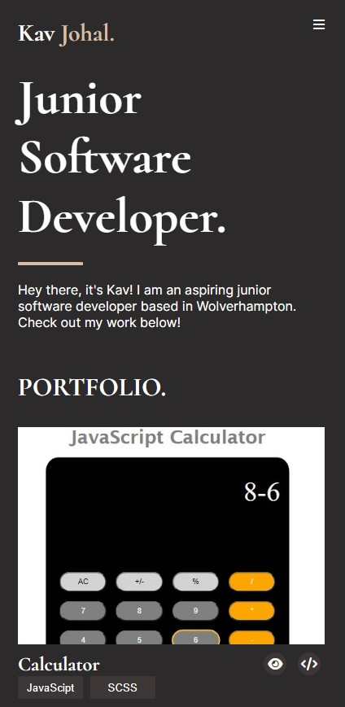

# Kavandeep-Portfolio
# MY PORTFOLIO

## Hello everyone! I approached this project using strictly what I have been taught so far: HTML & SCSS. *See image below* 

- Firstly, I broke down the content of the page into 6 sections:
    1. Navigation
    2. Title section
    3. Portfolio
    4. About me
    5. Contact
    6. Footer

- I then started writing up section-by-section the HTML & SCSS needed to create this project. To understand how it all worked/ linked together I've used BEM notation throughout my work.
  
