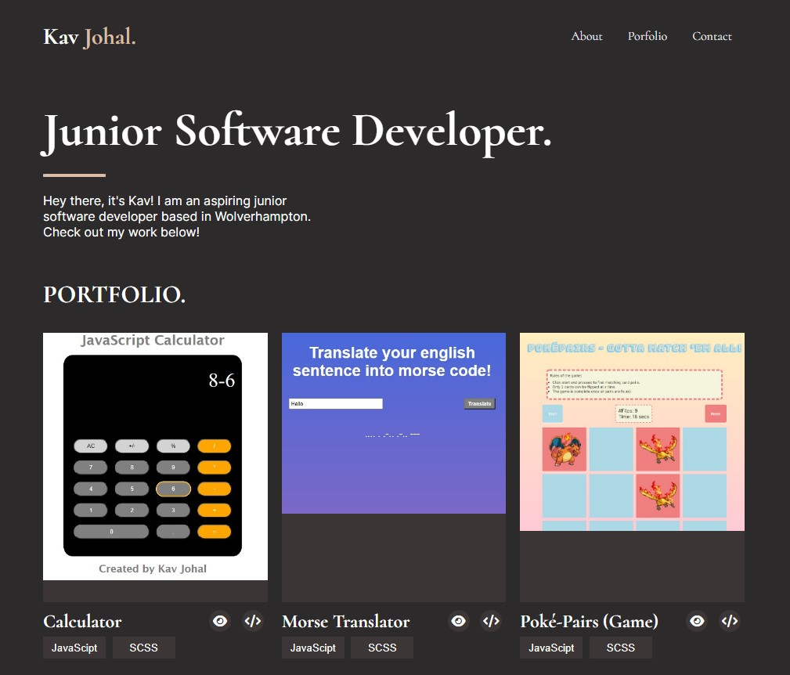

# Kav Johal - My Portfolio

Hello everyone! I approached this project using strictly what I have been taught so far: HTML & SCSS. Click [here](https://kav97.github.io/Kavandeep-Portfolio/) to view the project. 

    Firstly, I broke down the content of the page into 6 sections:
    - Navigation
    - Title section
    - Portfolio
    - About me
    - Contact
    - Footer

I then started writing up section-by-section the HTML & SCSS needed to create this project. To understand how it all worked/ linked together I've used BEM notation throughout my work.
 

## Project View 📱

 

| Mobile View | Desktop View |
|:---:|:---:|
|| |

 

## Future improvements 🌟
- I would like to redo this project using React. Using JSX components to create an interactive and 